# Denoising Autoencoder Classification

Introduction
============

Arguably one of the biggest hindrances to improving neural networks is the premium of labeled data. While unlabeled data is often abundant, labeled data usually requires some amount of human involvement. Ideally, one could leverage a large unlabeled data-set to improve generalization of a much smaller (possibly even incomplete) labeled data-set. We propose a new algorithm, Denoising Autoencoder Classification (DAC),, which uses autoencoders, an unsupervised learning method, to improve generalization of supervised learning on limited labeled data. In particular, we examine a case where the input signal is noisy and we explore the multi-task learning with two tasks: a classification output, coupled with a reconstruction output of a denoising autoencoder. DAC consistently achieves better classification accuracy on the validation set even with very limited labels.

DAC is an auxiliary-task model defined by two tasks (a denoising autoencoder and traditional classification given situations) where labeled data is sparse and unlabeled data is prolific, and input test data is noisy or corrupted. DAC yields significant improvements in classification of out-of-sample noisy data over purely supervised learning models over a variety of input data corruptions (Salt and Pepper, Blackout), architectures (CNN, Dense), and quantity of labeled data.

<!---
Introduction
============

Deep learning models have been shown to achieve excellent generalization performance when large amounts of labeled data are available (LeCun et al). However, labeling data is often expensive with regards to time, financial cost, and expertise. In this data driven world, the number and variety of applications for deep learning where unlabeled data is widely accessible and labeled data is sparse is ever increasing. Several Semi-Supervised learning methods (Chapelle et al., 2010) have been proposed in recent years to leverage large amounts of unlabeled data to improve the performance of supervised learning methods. Generally, these algorithms employ unsupervised learning techniques to learn additional structure purely about the input distribution.

In addition to the issue of generalization performance, in practical applications of machine learning, there is often a disconnect between the quality of the training data and the quality of the data used “at runtime”. That is, the input data used in practice can often be noisier or less conclusive than the data available at training. This problem arises in real world situations predominantly when dealing with varying costs or accessibility for differing hardware models. For example in the case of autonomous vehicles such as drones, state of the art LIDARs come at a high cost; and while it may be necessary to train deep learning models using the most accurate LIDARs, it is often unreasonable to utilize these LIDARs for mass production, either due to cost or weight. To address both the issues mentioned above, we explore a combination of existing strategies in order to improve generalization performance. Multitask learning has proven to be successful at improving generalization performance when there may be several metrics that define the ultimate goal (Ruder), and comes in many different forms such as joint learning, learning to learn, and learning with auxiliary tasks (Liu et al). In this work we employ an auxiliary-task model, in order to incorporate unsupervised learning methods into classification problems.

Regarding the field of unsupervised learning, there has been significant research of a breadth unique methods such as clustering, self-organizing maps, and GANs. For the purposes of multitask semi-supervised, Lei et al have recently demonstrated that a supervised autoencoder can sometimes improve generalization across several different architectures with varying activation functions and ranges of hidden layers. Though the methods from this work only yield marginal improvements on standard benchmark datasets, the paper does not explore applications to noisy input data. Interestingly, it has been shown that autoencoders can be used to build models that are robust to corruption (we use noise and corruption synonymous throughout this paper) of input data (Vincent et al). Following from these two results, we consider the use of using a supervised autoencoder in a multitask setting to improve generalization performance when dealing with noisy data.

Specifically, we consider Denoising Autoencoder Classification (DAC), an auxiliary-task model defined by two tasks a denoising autoencoder and traditional classification given situations where 1) labeled data is sparse and unlabeled data is prolific, and 2) input test data is noisy or corrupted. It has been shown that the addition of reconstruction error produces a bound on generalization error (Le et al). Empirically, we demonstrate that DAC yields significant improvements in classification of out-of-sample noisy data over purely supervised learning models. Even further, we show this over a variety of input data corruptions (Salt and Pepper, Blackout), architectures (CNN, Dense), and quantity of labeled data.
-->

Files
=====

`cifar.py` DAC model for portion of CIFAR

Required python libraries:
```
pip install numpy==1.14.*`
pip install sklearn
pip install matplotlib
pip install tensorflow
pip install keras
pip install keras-tqdm
```

Denoising Autoencoder Classification (DAC)
==========================================

Definitions
-----------

Throughout this section, we define the

-   Input space *X*

-   Labels/Output space *Y*

-   Intermediate decoded space *V*

-   Input data point *x* ∈ *X*

-   Noisy or corrupted input data point *x̄* ∈ *X*

-   Output label *y* ∈ *Y*

-   Intermediate encoding *z* ∈ *Z*

At a high level, DAC consists of two structural components: the denoising auto encoder, and the classifier.


Denoising Autoencoder
---------------------

The denoising autoencoder (figure \[fig:autoencoder\]) has similar structure to normal autoencoders, but instead of focusing on pure reconstruction of input data, it maps noisy inputs to their “clean” counterparts. In general, autoencoders consist of an encoder (*Φ* : *X* → *Z*) and a decoder (*Ψ* : *Z* → *X*) where *Φ* and *Ψ* are inversely related to eachother. They first map an input *x* ∈ *X* ∈ ℝ<sup>*d*</sup> to an intermediate representation *z* ∈ *Z* ∈ ℝ<sup>*d*</sup>′ of reduced dimensionality (*d*′&lt;*d*) via *Φ*. This intermediate representation is then “reconstructed“ back to a point *x*′ in the input space, and the difference between *x* and *x*′ is measured using some loss function *L*. In a denoising autoencoder (Vincent et al), a noisy representation of *x*, *x̄*, is fed into the network yielding *x̄*′, and then compared *x̄*′ to the original ”clean" input data point *x*. One important/interesting side effect of this setup is that unlike the basic autoencoder, this denoising autoencoder cannot learn the identity and thus it is not necessary that *d*′&lt;*d*.

For training purposes, we considered two autoencoder architecures: a dense single layer model and a deep convolutional model. In case of the former, both *Φ* and *Ψ* consist of one fully connected layer. We note that disregarding noise, this type of architecture trains weights that span the same subspace as PCA. Thus, to incorporate more complexity, we also considered a deep convolutional architecture, where *Φ* and *Ψ* consists of several mirroring convolutional, batch-normalization, and max-pooling/up-sampling layers. For both architectures we use mean squared error as the loss function difference between *x̄*′ and *x* and update weights.


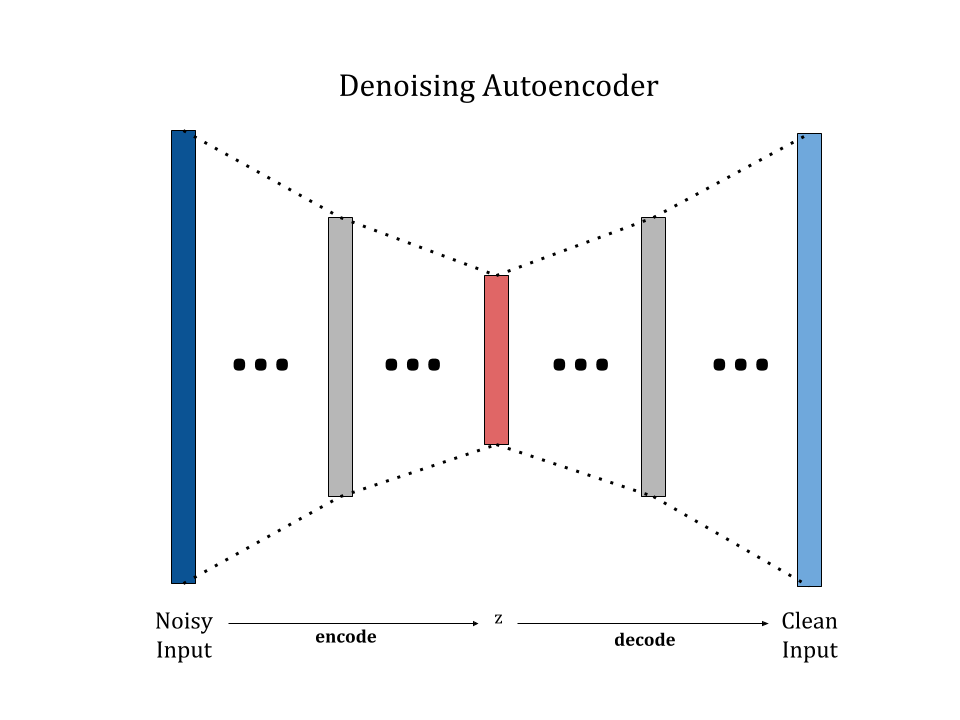

Classifier
----------

The classifier *θ* is built off of the intermediate representation *z* of the denoising autoencoder as shown in Figure \[fig:multitask\]. After encoding noisy input, a separate task is added (classification) that contributes the encoder weights independently from the decoder. Usually, this task consists of one fully connected layer that produces a prediction *y*′∈*Y*. Ultimately, both the classification loss (squared loss) and reconstruction loss propagate backwards and contribute to encoder weights.

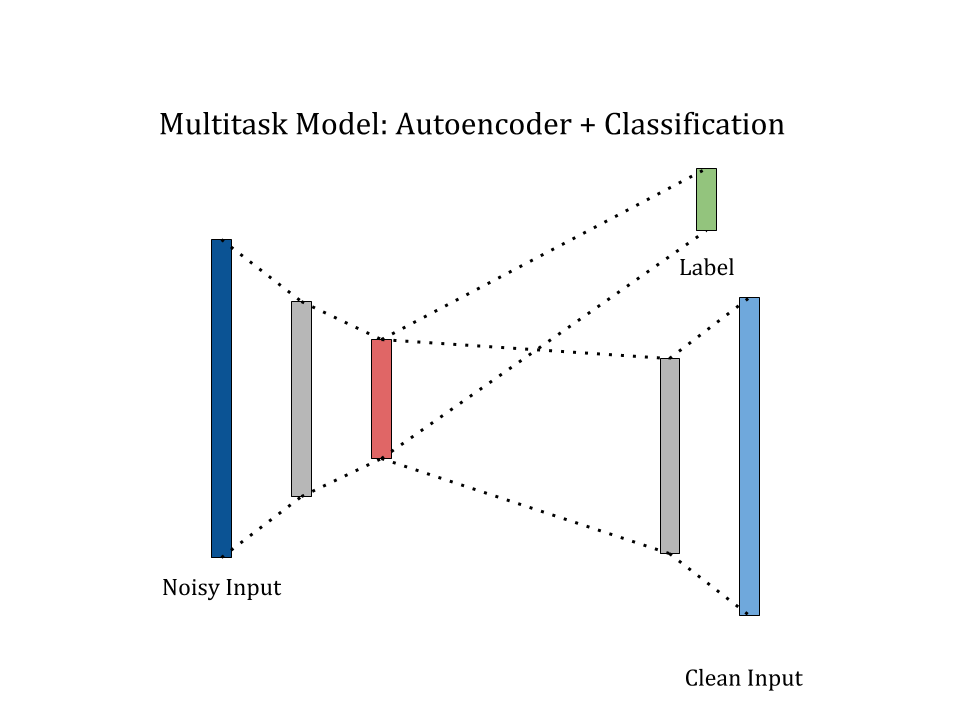

<!---
Uniform Stability and Generalization Bounds Analysis
====================================================

In this section we show that incorporating a denoising autoencoder can improve the theoretical generalization of noisy inputs. This analysis draws from Le et al’s results on uniform stability for their Supervised Autoencoder. In particular, we prove uniform stability for the DAC model which in turn proves a generalization bound from (Bosquet and Elisseeff).

Recall from section **2**, *Φ*, *Ψ*, *f* refer the encoder, decoder, and classification sections of DAC. Define

-   *L*<sub>*C*</sub>(*Φ* ∘ *f*(*x̄*),*y*) classification loss (here, we are using categorical cross-entropy)

-   *L*<sub>*A*</sub>(*Φ* ∘ *Ψ*(*x̄*),*x*) denoising autoencoder loss (generally mean squared error)

-   *n* the number of labeled training samples we use to train *θ* ∘ *Φ*

-   *N* the total number of unlabeled training samples used to train *Ψ* ∘ *Φ*

We seek to show uniform stability, i.e.

$$
 |L\_C (y\_j,h\_{S\_j}(x\_j))-L\_C (y\_j,h\_{S\_j^{i}}(x\_j))| \\leq \\beta,$$
 where *h*<sub>*S*</sub> and *h*<sub>*S*<sup>*i*</sup></sub> are classifiers (*θ* ∘ *Φ*) trained on sets *S* and *S*<sup>*i*</sup>, where the *i*-th sample is replaced by a new i.i.d sample.

First, we make the following remarks

Categorical cross entropy is strongly convex. That is, for some *c* ∈ ℝ<sup>+</sup>
$$\\begin{aligned}
 &\\left(\\nabla L\_C(\\Phi \\circ f(\\bar{x}),y)-\\nabla L\_C(\\Phi \\circ f^{\\prime}(\\bar{x}),y)\\right)^T(\\Phi \\circ f(\\bar{x})-\\Phi \\circ f^{\\prime}(\\bar{x}))\\\\ &\\ge c\\Vert \\Phi \\circ f(\\bar{x})-\\Phi \\circ f ^{\\prime}(\\bar{x})\\Vert ^2, \\end{aligned}$$
 where ∇*L*<sub>*C*</sub>(*Φ* ∘ *f*(*x̄*),*y*) is the gradient of *L*<sub>*C*</sub> with respect to *Φ* ∘ *f*(*x̄*)

Mean squared error is strongly convex. It is necessarily true that cross categorical loss is strongly convex when *Φ* ∘ *Ψ* is restricted to some range (Liu et al). Thus, for some *c* ∈ ℝ<sup>+</sup>
$$\\begin{aligned}
 &\\left(\\nabla L\_A(\\Phi \\circ \\Psi(\\bar{x}),x)-\\nabla L\_A(\\Phi \\circ \\Psi^{\\prime}(\\bar{x}),x)\\right)^T(\\Phi \\circ \\Psi(\\bar{x})-\\Phi \\circ \\Psi^{\\prime}(\\bar{x}))\\\\ &\\ge c\\Vert \\Phi \\circ \\Psi(\\bar{x})-\\Phi \\circ \\Psi ^{\\prime}(\\bar{x})\\Vert ^2, \\end{aligned}$$
 where ∇*L*<sub>*A*</sub>(*Φ* ∘ *Ψ*(*x̄*),*y*) is the gradient of *L*<sub>*A*</sub> with respect to *Φ* ∘ *Ψ*(*x̄*).

Additionally we make the following assumptions which follow from the specific case of the DAC model:

The loss function function is *σ*-admissible, i.e.
|ℓ(*y*, *h*(*x*)) − ℓ(*y*, *h*<sup>′</sup>(*x*))|≤*σ*|*h*(*x*)−*h*<sup>′</sup>(*x*)|.

Here, the classification loss used (log-loss) ℓ = *L*<sub>*C*</sub> and the reconstruction loss (mean squared error) ℓ = *L*<sub>*A*</sub> both satisfy this property.

There exists a subset *B* ⊂ {*x̄*<sub>1</sub>, …, *x̄*<sub>*N*</sub>} such that for any feature vector *x* ∈ {*x̄*<sub>1</sub>, …, *x̄*<sub>*n*</sub>}, it holds that *x* = ∑*α*<sub>*i*</sub>*b*<sub>*i*</sub> + *η* where *η* is a small error that satisfies ∥*η*∥≤*ϵ* and |*α*|≤*r*.

Essentially, set of input images for each task need to be able to reconstruct each other. This assumption is actually very mild, and is a special case of Assumption 1. in (Liu et al), which covers a general multi-task setup. Given random inputs the assumption will hold with *η* = 0 if the sample size reaches the dimension of *X* as *B* can form a basis for the whole input space *X*.

The logistic loss used for classification is *L*-Lipschtiz with $L = \\sup\_t \\left| \\frac{d}{dt} \\log (1 + e^{-t} ) \\right| = 1$.

The above assumptions enable us to use the uniform stability result proved in (Liu et al.).

When the loss function *L*<sub>*C*</sub> is *c*-strongly convex, *σ*-admissible, upper bounded by *M*, and *B* exists with coefficients ≤*r*:
$$\\begin{aligned}
 |L\_C (y\_j,h\_{S\_j}(x\_j))-L\_C (y\_j,h\_{S\_j^{i}}(x\_j))| \\le \\frac{2\\sigma ^2 r^2 N}{n c},\\end{aligned}$$
 where *h*<sub>*S*</sub> and *h*<sub>*S*<sup>*i*</sup></sub> are classifiers (*θ* ∘ *Φ*) trained on sets *S* and *S*<sup>*i*</sup> where the *i*-th sample is replaced by a new i.i.d sample.

Finally, this gives us a $O(\\frac{1}{n})$ generalization bound with respect to the number of labeled samples *n* (the number of unlabeled samples *N* remains fixed).
-->

Experiments
===========

We used the CIFAR-10 dataset consists of 50000 training and 10000 test 32 × 32 × 3 colour images in 10 classes. Each pixel channel is normalized to have values between 0 and 1. Note that we use these datasets to extract a comparison of models, rather than to match performance of the current state-of-the-art. Further, the addition of noise makes the learning problem more difficult and naturally drives down final classification accuracies.

Noise
-----

To simulate lower-quality or corrupted training data, we introduce loss to the input. Two types of noise were used:

-   Salt and pepper (s&p): 10% of the pixels are randomly sampled and turned to black (0, 0, 0) and 10% of the pixels are randomly sampled and turned to white (1, 1, 1).

-   Blackout: 30% of the pixels are turned to black (0, 0, 0).

Examples of the two types of input distortion can be seen in Figure \[fig:denoise\_examples\].

Number of Labeled Training Samples
----------------------------------

Our research targets how larger unlabeled datasets can improve generalization of supervised learning with limited labels. As such, it is prudent to compare the validation accuracy of the DAC and unregularized models while varying the amount of labels in the training data. Below, we display results after training the classification output of both models on 1000, 10000 or 50000 labeled images. Note that the denoised output is always still trained with all 50k unlabeled images.

Training Procedure
------------------

The unregularized model is trained to minimize categorical cross-entropy loss from the classification output on the labeled training images for 80 epochs.

The DAC model is first trained to minimize MSE from the reconstruction output on the entire unlabeled training set for 25 epochs. During this stage, no weight updates are computed for edges between the encoded layer and classification output. The results are discussed in section 5.1.

The DAC model is then trained to minimize the sum of MSE from the reconstruction output and categorical cross-entropy loss from the classification output on the labeled training images for 80 epochs.

The Adam optimizer is used with a learning rate of 5 ⋅ 10<sup>−5</sup> and a batch size of 32 in each of the training stages. For the classification output of the DAC model for the CNN architecture in particular, the learning rate is decreased to 10<sup>−5</sup> the `loss_weight` parameter is set to 0.1 for the categorical cross-entropy loss and 1 for the MSE loss. This is to prevent the gradient updates to minimize classification loss from drastically increasing the reconstruction loss (this would defeat the purpose of the technique).

Results
=======

Reconstruction Quality of the DAC Models
----------------------------------------

The reconstruction task of the DAC model involves taking an input image with noise and producing the original image without noise. For each noise and architecture, we train five models the same way and present the average and standard deviation of their reconstruction losses in Table 1. The validation reconstruction loss (MSE) is significantly smaller in the CNN autoencoder architecture compared to the dense architecture. This result is also visually verifiable with the reconstruction output of the two denoising autoencoders (Figure 1). This is unsurprising: the much higher complexity of a model with fully-connected dense layers compared to shared-weight convolutional layers lend to poorer generalization in the denoising task. While the denoising auto-encoder is not the core focus of this experiment, higher quality of reconstruction should lead to better regularization of the classification training.


 &nbsp; 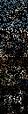 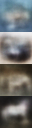 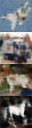 &nbsp; 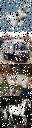 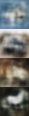 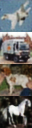 

*Figure 1: Left: four images from training data. Middle: the same images with blackout noise applied, then reconstructed by dense and CNN denoising autoencoders respectively. Right: equivalent for salt and pepper noise.*

|                 |       |                                |                                |
|:----------------|:------|:-------------------------------|:-------------------------------|
| Salt and Pepper | Dense | 0.01245  ± 1 ⋅ 10<sup>−5</sup> | 0.01188  ± 3 ⋅ 10<sup>−5</sup> |
| Salt and Pepper | CNN   | 0.00157  ± 4 ⋅ 10<sup>−5</sup> | 0.00117  ± 8 ⋅ 10<sup>−5</sup> |
| Blackout        | Dense | 0.01795  ± 2 ⋅ 10<sup>−5</sup> | 0.02066  ± 4 ⋅ 10<sup>−5</sup> |
| Blackout        | CNN   | 0.00494  ± 5 ⋅ 10<sup>−5</sup> | 0.00430  ± 5 ⋅ 10<sup>−5</sup> |

*Table 1: Reconstruction Mean Squared Error of Denoising Autoencoders*

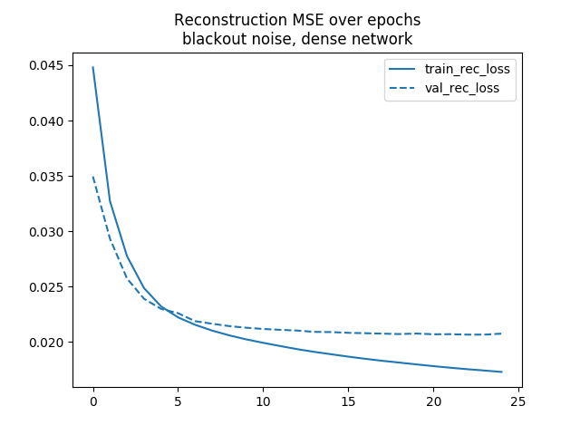 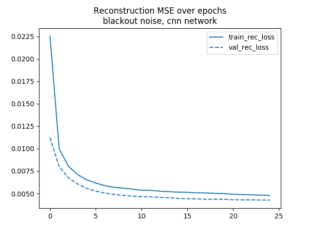 
*Figure 2: The denoising autoencoder on the dense architecture performs much worse than the CNN architecture, appearing to overfit and blur the image significantly.*

Generalization Improvement of DAC versus Unregularized Models
-------------------------------------------------------------

From Table 2 and Figure 3, it is apparent that the DAC offers significantly higher validation classification accuracy over the unregularized counterpart. The reconstruction task slows down the tendency to overfit, by ensuring the shared layer still contains enough information to reproduce the original image. This aligns with results in (Le et al.) which also show around 2% improvements for single-layer dense autoencoders and 5% for deep CNN networks, albeit with the full training set without added noise.

With the CNN architecture in particular, we observe that a similar validation accuracy can be achieved with 5 or 10 times less labeled training images when using the DAC regularizer, a positive indication that DAC can generalize better in learning problems where labels are sparse.

The improvements for the dense single-layer models are much less significant. The dense networks also perform worse in the denoising reconstruction task (Table 1, Figure 2). In this case, the reconstruction loss is so large that the denoised image is similar to a very broad Gaussian blur. We thus would not expect to retrieve significant regularization from the denoising output loss, as it is not encoding enough information to make a good reconstruction. In fact, when trained on all the examples, the regularized and unregularized models have comparable performances within variance. The CNN models, however, do effectively reconstruct a de-noised image without excessive blur and the denoising loss does provide significant regularization such that the training and validation curves are much closer together (Figure 3). This aligns with the hypothesis that the improvements depend on the autoencoder effectively extracting noise-resistant features, which are then used to learn the classification task.

We also discovered that training the classification output of the DAC model required careful tuning of the loss weight parameters. If they were equally weighted, the validation reconstruction loss from the denoising autoencoder would increase over the epochs, and the denoising autoencoder would become ineffective. his corresponded with lower validation accuracy on the classification task. In particular, we needed to weight the class loss lower (`weight`=0.1) and the reconstruction loss higher (`weight`=1.0) to keep the reconstruction error constant across epochs and maintain quality of the denoising autoencoer. This indicates that the quality of the reconstruction output is tied closely with the generalization of the classification output.

|                 |       |       |                |                |
|:----------------|:------|:------|:---------------|:---------------|
| Salt and Pepper | Dense | 1000  | 26.5 ± 0.1     | **29.0** ± 0.1 |
| Salt and Pepper | Dense | 10000 | 36.6 ± 0.2     | **38.0** ± 0.7 |
| Salt and Pepper | Dense | 50000 | **45.2** ± 0.2 | 45.1 ± 0.2     |
| Salt and Pepper | CNN   | 1000  | 24.2 ± 0.1     | **32.8** ± 0.1 |
| Salt and Pepper | CNN   | 10000 | 32.6 ± 0.3     | **42.1** ± 0.2 |
| Salt and Pepper | CNN   | 50000 | 41.8 ± 0.2     | **51.6** ± 0.1 |
| Blackout        | Dense | 1000  | 19.6 ± 0.1     | **21.7** ± 0.1 |
| Blackout        | Dense | 10000 | 26.3 ± 0.2     | **29.2** ± 0.1 |
| Blackout        | Dense | 50000 | **34.0** ± 0.2 | 33.6 ± 0.2     |
| Blackout        | CNN   | 1000  | 20.2 ± 0.1     | **32.0** ± 0.1 |
| Blackout        | CNN   | 10000 | 27.7 ± 0.3     | **40.1** ± 0.2 |
| Blackout        | CNN   | 50000 | 38.0 ± 0.2     | **49.4** ± 0.1 |

*Table 2: Validation Accuracy of Classification Output for DAC and Unregularized models*

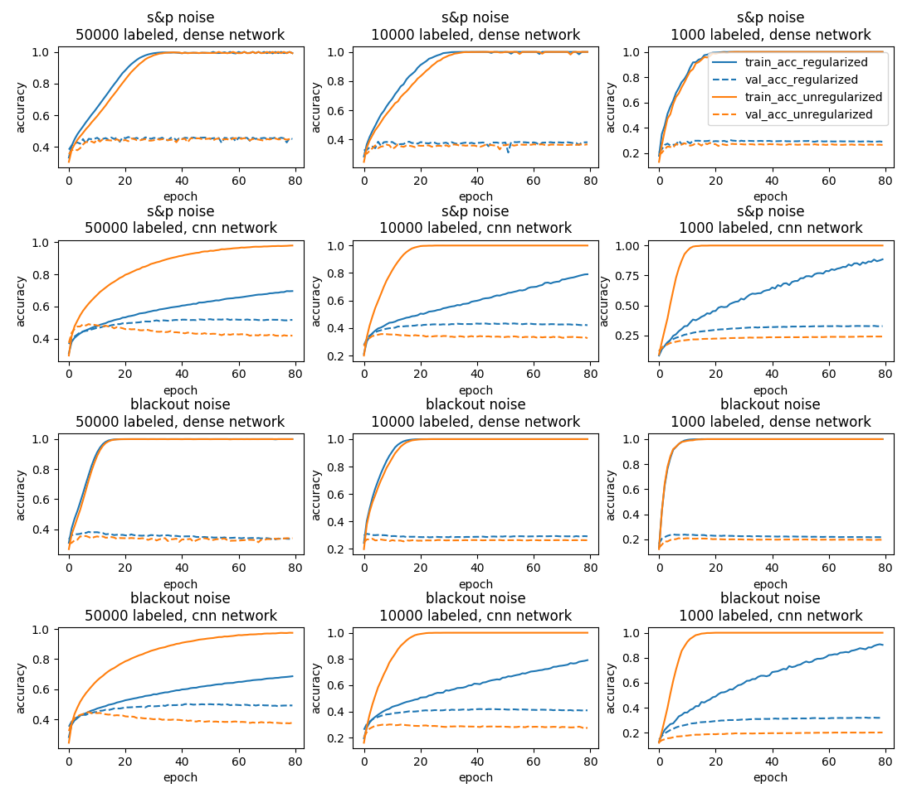 

*Figure 3: the training accuracy (solid line) of the unregularized classifiers, shown in orange, increases very quickly, often reaching 100\% before 20 epochs, but the validation accuracy (dotted line) does not follow, indicating significant overfitting and poor generalization. Due to the additional denoising task, DAC (shown in blue) achieves better validation accuracy than the unregularized classifier, even when training accuracy favors the latter. Especially on the CNN architecture, the divergence of the training and validation accuracies is much slower, which indicates the algorithm has better generalization. Overall, CNN’s yield much better generalization results than dense single layer networks for both the regularized and unregularized models.*


References
==========================

Chapelle, O., Schlkopf, B., and Zien, A. Semi-Supervised Learning. *The MIT Press*, 1st edition, 2010. ISBN 0262514125, 9780262514125.

Le, L. Patterson, A, and White, M. Supervised autoencoders: Improving generalization performance with unsupervised regularizers. In *Advances in Neural Information Processing Systems (NeurIPS)*, 2018.

Yann LeCun, Yoshua Bengio, and Geoffrey Hinton. 2015. Deep learning. *Nature* 521, 7553 (2015), 436.

Tongliang Liu, Dacheng Tao, Mingli Song, and Stephen J Maybank. Algorithm-Dependent Generalization Bounds for Multi-Task Learning. *IEEE Transactions on Pattern Analysis and Machine Intelligence*, 2017.

Ruder, S. (2017). An Overview of Multi-Task Learning in Deep Neural Networks. ArXiv e-prints.

Vincent, P., Larochelle, H., Bengio, Y. & Manzagol, P.-A. Extracting and composing robust features with denoising autoencoders. In Proc. 25th International Conference on Machine Learning 1096–1103 (2008).

Bousquet, O. and Elisseeff, A. Stability and Generalization. *Journal of Machine Learning Research*, 2002.

Oberman, A. and Calder J. Lipschitz regularized Deep Neural Networks generalize. Under review for ICLR 2019.

